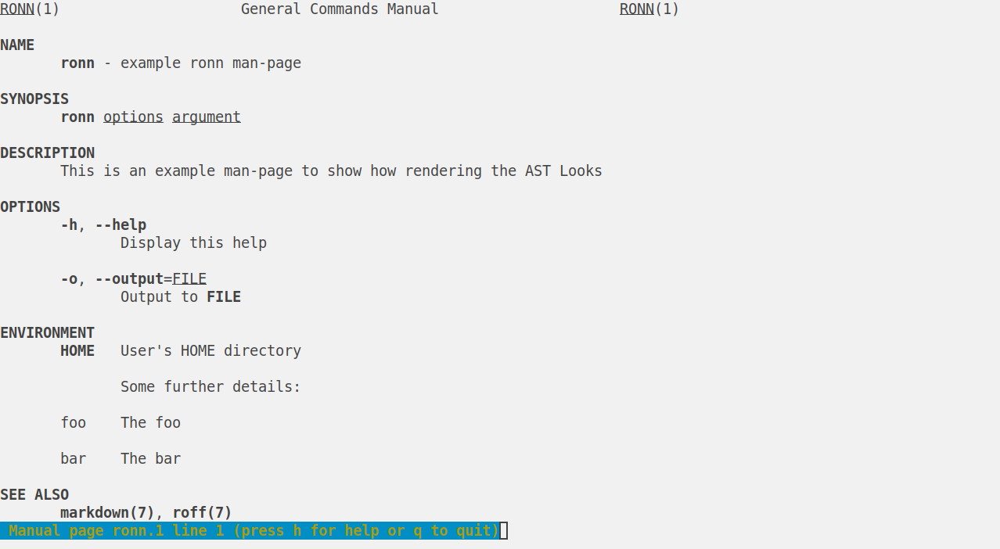

## Ronn

Describe and render Ronn documentation.

## Why Ronn?

Ronn is a [markdown-like format][ronn-format.7] for describing man-pages. Files
written in Ronn can be viewed as markdown (e.g. rendered on GitHub), or
converted to Roff or HTML using the `ronn` command-line.

[ronn-format.7]: https://github.com/apjanke/ronn-ng/blob/main/man/ronn-format.7.ronn

There are _many_ ways to author or produce man-pages in Roff and HTML formats
from a single source, but Ronn produces *by far* the highest-quality outputs
from the simplest source. Tools like `man2html` or even Pandoc often produce
sub-standard output in certain cases, or lack features such as cross-references.

Here is some example Ronn:

```ronn
ronn(1) -- example ronn man-page
================================

## SYNOPSIS

`ronn` [options] <argument>

## DESCRIPTION

This is an example man-page to show how rendering the AST Looks

## OPTIONS

  * `-h`, `--help`:
    Display this help

  * `-o`, `--output`=<FILE>:
    Output to `FILE`

## ENVIRONMENT

  * `HOME`:
    User's HOME directory

    Some further details:

      * foo:
        The foo

      * bar:
        The bar

## SEE ALSO

**markdown(7)**, **roff(7)**
```

Here is it rendered to Roff and opened with `man`:



And here it is rendered to HTML:


This package contains the `Ronn` AST type and a rendering function. Companion
packages are planned to automatically convert any `optparse-applicative`,
`envparse`, or `opt-env-conf` `Parser` type into a `Ronn` value. This will allow
any application using one of these libraries to maintain high-quality man-pages
automatically.

## Usage

For an example of building an AST by hand, and what the rendered `Text` looks
like, see the [test suite](./tests/Ronn/RenderSpec.hs)

Once you've created a `.ronn` file from the rendered `Text`, you can use the
[`ronn-ng`][ronn-ng] gem produce a high-quality man-page and HTML:

```console
% ronn --style toc --roff --html path/*.ronn
```

[ronn-ng]: https://github.com/apjanke/ronn-ng

---

[LICENSE](./LICENSE) | [CHANGELOG](./CHANGELOG.md)
